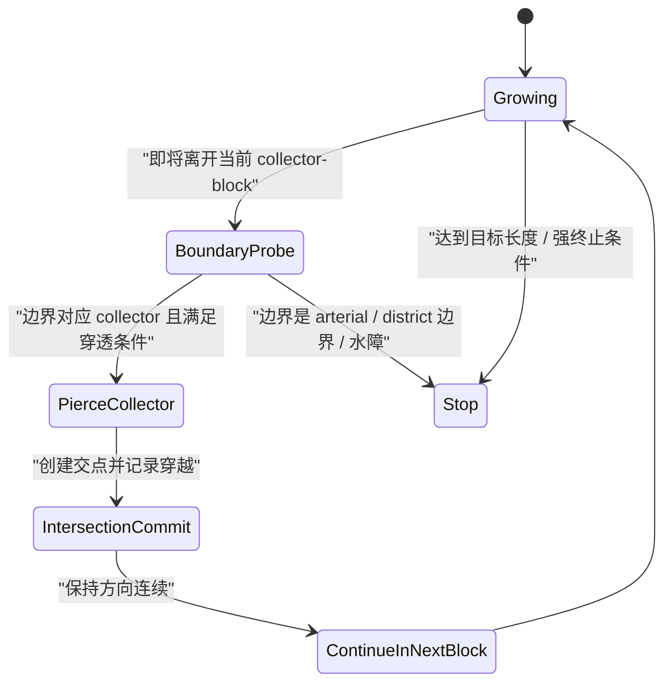

# 跨街区语义连续与 `Local Spine / Sub-collector` 设计草案

本文档是对当前道路生成实现的架构级改进方案，目标不是“暴力拉长 local edge”，而是：

- 保持现有拓扑切分（intersection split）的严谨性
- 引入跨 block 的语义连续街道机制（`street-run`）
- 增加一层介于 `collector` 与 `local` 之间的“社区骨架”道路（建议命名：`local_spine` / `sub_collector`）

配套现状文档：

- `/Users/shiqi/Coding/github/GIStudio/CityGen/docs/road_generation_current_algorithm.md`

## 1. 设计背景与问题定义

### 1.1 当前问题（本质）

当前 `local` 道路生成无法稳定达到 1–2km 的连续街道感，根因不是单个参数，而是架构层约束：

1. `local` 在 collector 切分后的 block 内生成（空间域受限）
2. `block_exit` / `near_network` 会让 trace 在触达边界/网络时终止
3. 后续 `intersection` 操作会把长线切成多个短 `edge`

因此“看 `edge.length_m` 不够长”并不等价于“街道语义不连续”；同时，当前架构也确实缺少允许跨 block 延续的生成机制。

### 1.2 设计目标（本方案）

本方案要实现的不是“所有 local 都变长”，而是：

- 普通 `local` 继续承担街区内部填充与 cul-de-sac 角色
- 新增一类“社区骨架”道路，用于跨多个 collector block 形成 1–2km 的连续街道
- 评估指标从 `edge length` 升级为 `street-run length`

## 2. 核心设计决策（锁定）

### 2.1 长度目标作用对象

`1–2km` 的目标作用在：

- `street-run`（连续街道段）

而不是：

- 单条拓扑 `edge`
- 单条 block 内 `local` trace

### 2.2 层级策略

采用新增层级方案：

- `arterial`
- `collector`
- `local_spine`（或对外命名 `sub_collector`）
- `local`

其中：

- `local_spine` 负责跨 block 串联
- `local` 保持短线/填缝/末梢特征

### 2.3 穿透规则

`local_spine` 允许：

- 有条件穿越 `collector`（形成交叉口后继续）

`local_spine` 不允许（默认）：

- 穿越 `arterial`
- 无约束穿越河流与强水域屏障

### 2.4 评估指标升级

新增 `street-run` 聚合层，并以其作为长度验收依据：

- `spine_street_run_len_p50_m / p90_m / p99_m`
- `spine_street_run_target_band_rate`（1–2km）

## 3. 分层架构升级（Hierarchy Redesign）

### 3.1 新层级定位：`local_spine` vs `sub_collector`

建议采用“两阶段命名策略”：

- **内部过渡名（低改动）**：`local_spine`（作为 `local` 的 flag 或 subtype）
- **最终公开层级名（语义清晰）**：`sub_collector`

原因：

- 当前 `/engine/roads/intersections.py`、`/engine/roads/syntax.py`、渲染和指标逻辑对 `road_class` 取值有显式判断
- 直接新增 `road_class="sub_collector"` 会触发较大范围修改
- 用 `flags={"local_spine"}` 过渡能快速验证架构正确性，再升级为独立 `road_class`

### 3.2 物理属性建议（设计值）

初始建议（可调）：

- `width_m`: `7.5–9.5`（介于 local 的 `6` 与 collector 的 `11` 之间）
- `render_order`: 介于 `collector` 与 `local`
- 默认允许更长几何平滑段（较弱“noodle”判定）

### 3.3 作用域划分（关键）

将 “local 类道路”拆成两种空间域：

1. **`local_spine` 空间域**
   - 在“arterial 主骨架围成的 district（大区）”内生成
   - `collector` 作为可穿透障碍（可形成交叉）
   - `arterial` 作为硬边界（通常终止）

2. **普通 `local` 空间域**
   - 继续在 collector 细分出的 block 内生成
   - 负责短街、分支、cul-de-sac、内部填充

这会自然解决“collector block 空间牢笼”的问题，而无需粗暴拉大 `collector_spacing_m`。

## 4. 空间域模型：从 Block 到 District

### 4.1 当前约束回顾

当前 `classic_local_fill` 使用的是 collector 之后的 block 集合，因此：

- 任何 `local trace` 都受 `block_exit` 硬终止约束

### 4.2 新空间域：`arterial_districts`

新增一个更高层空间域（建议命名）：

- `arterial_districts`

构建方式（设计）：

- 使用仅含 `arterial`（必要时加 hub 连接）的道路网络提取多边形面
- 结果是被主干道围合的“片区”
- `collector` 仅作为片区内内部线网，而不是 `spine` 的硬边界

### 4.3 为什么不是直接改 `block_exit`

直接在 `local` 上放松 `block_exit` 会导致：

- 普通 local 与 collector/local 层级职责混淆
- 更难控制 cul-de-sac 与填缝局部道路的尺度
- 容易重启“面条”问题

引入 `arterial_districts + local_spine` 能把“跨 block 长街”变成显式策略，而不是在现有 local 状态机里打补丁。

## 5. `Local Spine` 跨街区生长机制（Cross-Block Routing）

### 5.1 生成阶段位置（建议）

在现有 `/engine/roads/network.py::_generate_hierarchy_linework(...)` 中，建议插入顺序：

1. `collector` 生成完成
2. **`local_spine` 生成（新）**
3. `local` 生成（现有 `classic_sprawl` / `grid_clip`）
4. `local reroute`

原因：

- `spine` 需要 collector 作为“可穿透参考网络”
- 普通 `local` 需要在 `spine` 生成后进一步细分/填充

### 5.2 Spine Agent 状态机（设计）

核心思想：

- 碰到 `collector` 不等于死亡
- 碰到 `collector` 时优先“创建交点并延续”
- 碰到 `arterial` 或强屏障时终止

### 5.3 穿透 `collector` 的判定条件（建议）

当 `spine trace` 触达 collector 或将离开当前局部 block 时，若满足以下条件，则允许穿透：

- 命中的是 `collector`（非 `arterial`）
- 与 collector 交角接近正交或在容差内（避免沿 collector 滑行被误判为穿透）
- 未超过本条 spine 的 collector crossing budget
- crossing 点附近不在河流/禁行几何内
- 连续穿透次数不超过局部阈值（避免直线暴走）

建议参数（初版）：

- `spine_collector_cross_max_per_run = 6~12`
- `spine_cross_angle_min_deg = 55`
- `spine_cross_angle_max_deg = 125`
- `spine_cross_snap_radius_m = 10~18`

### 5.4 方向维持与“抗抖动”机制

为了得到 1–2km 的连续街道感，`spine` 需要比普通 `local` 更强的方向持久性：

- 降低每步转向噪声
- 降低分支概率（主干优先）
- 提高直行存活率（仅对 `spine`）
- 保留地形约束，但以“平滑偏转”代替频繁蛇形

建议引入 `spine_direction_persistence`（概念参数）：

- 结合上一段方向、全局 seed 方向、近邻 collector 正交方向
- 对坡度/河岸偏置进行限幅（`clamped influence`）

### 5.5 终止条件（`spine` 专用）

与普通 local 区分：

- **保留**
  - `arterial_hit`
  - `river_blocked`
  - `district_exit`
  - `self_intersection`
  - `max_len`
- **弱化/调整**
  - `stochastic_stop`（在目标最小长度前禁用）
  - `noodle_curve`（提高阈值，仅防极端异常）
  - `span_cap`（改为面向 spine 的更大阈值）
- **新增**
  - `collector_cross_budget_exhausted`
  - `alignment_decay`（方向连续性严重失真）

## 6. 普通 `Local` 的角色重定义（不是废弃）

### 6.1 保留普通 local 的职责

普通 `local` 仍然负责：

- block 内填充
- 短距离连通
- cul-de-sac
- 居住区细碎支路

这意味着我们不再要求：

- 普通 `local trace` 达到 1–2km

而是把 1–2km 目标转移到：

- `local_spine` 的 `street-run`

### 6.2 对现有 `classic_local_fill` 的影响（未来实现）

未来可以把当前 `classic_local_fill` 拆为两套 profile：

- `spine profile`（强方向、低分支、可穿越 collector）
- `local fill profile`（现有 block 内规则）

也可以实现为两个不同生成器函数，以降低复杂度耦合。

## 7. `Street-run` 链式聚合算法（Semantic Stitching）

这是本方案的第二根支柱：即使拓扑 edge 被切碎，仍然能得到语义连续街道。

### 7.1 目标

将后处理后的碎片化 `edge` 聚合为“连续街道段（street-run）”，用于：

- 指标评估（1–2km）
- 可视化（高亮连续街道）
- 后续命名系统（同一 run 给同一街道名）

### 7.2 基本原则（Good Continuation）

在一个交点 node 上，两个 edge 是否属于同一 `street-run`，由以下条件综合判断：

1. 共享同一 node
2. 切线方向近似连续（小夹角）
3. 等级/子类型兼容（如 `local_spine` 优先接 `local_spine`）
4. 几何宽度相近（避免把 collector 和 local 混成一条）
5. 不跨越禁止的语义边界（如 `arterial` 交点处默认断开）

### 7.3 推荐算法：基于“互选连续”的 Stroke Building

建议使用“笔画构建（stroke building）”式算法，而不是单纯 DFS 全连：

#### Step A：为每条 edge 在端点计算局部切线

- 从 `path_points` 提取端点切向量
- 若无 `path_points`，使用 `u->v` 直线方向

#### Step B：在每个 node 构建 continuation 候选

对每个 incident edge 对：

- 计算偏转角 `deflection_deg`
- 过滤超过阈值的候选（如 `> 15°` for spine，`> 25°` for local）
- 按得分排序

候选得分可包含：

- `angle_score`
- `class_match_score`
- `width_similarity_score`
- `spine_flag_bonus`

#### Step C：互选配对（mutual best continuation）

仅当两个半边互相把对方选为最佳 continuation 时，建立“同一 street-run”连接。

优点：

- 避免在十字路口把一条路误并到侧向支路
- 对网格路口更稳定

#### Step D：在 continuation 图上提取最大链

- 将 edge 视为节点，continuation 关系视为边
- 提取连通分量（通常是链或简单分支）
- 对分支冲突点可保守拆分，优先保持“单一主链”

### 7.4 `Street-run` 数据结构（建议）

新增内部结构（不一定立刻进 API）：

- `StreetRun`
  - `id`
  - `edge_ids: list[str]`
  - `road_class`（聚合后的主类）
  - `flags`（如 `local_spine_run`）
  - `length_m`
  - `node_ids`
  - `start`, `end`
  - `mean_bearing_deg`
  - `deflection_sum_deg`

### 7.5 命名系统（后续收益）

`street-run` 结果可以直接作为命名输入实体：

- 一条 run -> 一个道路名称候选
- 避免同一条视觉长街被切成十几个不同名字

这对 AI 命名一致性会有非常大帮助。

## 8. 指标与验收体系（Metrics & Acceptance）

### 8.1 新指标（建议新增）

按 `street-run` 聚合后新增：

- `street_run_count`
- `street_run_len_p50_m`
- `street_run_len_p90_m`
- `street_run_len_p99_m`

按 `local_spine` 子集新增：

- `spine_street_run_count`
- `spine_street_run_len_p50_m`
- `spine_street_run_len_p90_m`
- `spine_street_run_len_p99_m`
- `spine_street_run_target_band_rate_1km_2km`

辅助诊断指标：

- `spine_collector_crossings_per_run_p50`
- `spine_terminated_by_arterial_ratio`
- `spine_terminated_by_river_ratio`
- `street_run_merge_reject_angle_count`

### 8.2 验收口径（替代旧口径）

从“edge 长度”切换为：

- `spine_street_run` 的长度分布

示例验收（可按 preset 调整）：

- 对 `mixed_organic`、`collector_spacing=420`、`local_spacing=130`：
  - `spine_street_run_len_p50_m >= 800`（初期目标）
  - `spine_street_run_target_band_rate_1km_2km >= 0.35`
  - 不显著恶化 `illegal_intersection_count`
  - 不显著恶化 `block/parcels` 可视化质量

说明：

- 初期目标不必一步到位 1–2km 全覆盖，应先验证体系正确性。

## 9. 与现有后处理模块的集成策略

### 9.1 `intersections.py`

需要保证：

- `local_spine`（无论是独立类还是 flag）参与现有 intersection operators
- split 后 flag 不丢失（尤其 `local_spine`）

如果采用 flag 过渡方案：

- 当前 flag 复制/重建逻辑已较完善，可复用

### 9.2 `syntax.py`

短期策略：

- `local_spine` 不进入 syntax 计算（仍只对 arterial+collector）

中期策略（可选）：

- 若升级为 `sub_collector`，评估是否纳入 syntax 宽化但不纳入剪枝

### 9.3 `stageRenderer` / Web 可视化

短期（不改 schema）：

- 用 `road.flags` 中的 `local_spine` 做差异化样式

中期（独立 `road_class`）：

- 增加 `sub_collector` 图层样式与图例
- 可增加 `street-run` 调试层（按 run 高亮）

## 10. 分阶段落地计划（推荐）

### Phase 0：指标先行（低风险）

目标：

- 在不改生成器的前提下先实现 `street-run` 聚合与指标

收益：

- 立刻停止用 `edge.length_m` 误判质量
- 为后续 `spine` 方案提供量化基线

输出：

- `street-run` 聚合器（后处理/分析模块）
- 新 metrics + notes
- 可选调试渲染层

### Phase 1：`local_spine` 作为 `local` flag（中风险）

目标：

- 新增跨 block 的 spine 生成器，但输出仍为 `road_class="local"` + `flags={"local_spine"}`

收益：

- 最小化对现有交叉口、渲染、导出格式的冲击
- 验证“跨 collector 延续”的生成机制

### Phase 2：升级为独立层级 `sub_collector`（较高收益）

目标：

- 在 schema/渲染/指标中正式引入 `sub_collector`

收益：

- 层级语义清晰
- 调参与渲染更可控

### Phase 3：命名与高级分析集成（增值）

目标：

- `street-run` 驱动命名
- 形成稳定的道路语义对象层

## 11. 风险与规避

### 11.1 风险：重新引入“面条路”

风险来源：

- `spine` 为了追求长距离，过度放松 `noodle_curve`/转角约束

规避：

- `spine` 使用更强方向持久性，而不是纯放松约束
- `noodle_curve` 仅宽松，不关闭
- 增加 `alignment_decay` 终止

### 11.2 风险：层级边界模糊

风险来源：

- `spine` 与 `collector`、`local` 功能重叠

规避：

- 明确 `spine` 的主要职责是“跨 collector 串联”
- 普通 `local` 继续 block 内填充
- 不让 `spine` 穿越 arterial

### 11.3 风险：后处理切分破坏语义

风险来源：

- `intersection split` 必然切碎 edge

规避：

- 这是预期行为，不是 bug
- 用 `street-run` 聚合恢复语义连续

## 12. 需要在实现前确认的产品/算法决策（待定项）

以下项建议在动代码前明确：

1. **对外命名**
   - `local_spine` 还是 `sub_collector`
2. **穿透权限**
   - 是否允许穿越 `collector` 后立即再穿越下一个 `collector`（连续 crossing 上限）
3. **街道连续判定阈值**
   - `street-run` 切线夹角阈值（spine 与 local 是否不同）
4. **渲染策略**
   - 是否在 UI 中单独显示 `Spine` 图层
5. **指标目标**
   - 第一阶段验收基线（不要一步把目标定死在 1–2km 全覆盖）

## 13. 建议的首个实现顺序（最小正确闭环）

如果下一步开始实现，我建议按以下顺序：

1. 先做 `street-run` 聚合与指标（不改生成）
2. 再做 `local_spine` 生成（先 flag 方案）
3. 再做前端样式与调试层
4. 最后决定是否升格为 `sub_collector` 独立 `road_class`

这样能最快验证“语义连续性”是否真的解决了你的目标问题，同时避免一次性改太多模块导致回归难以定位。

