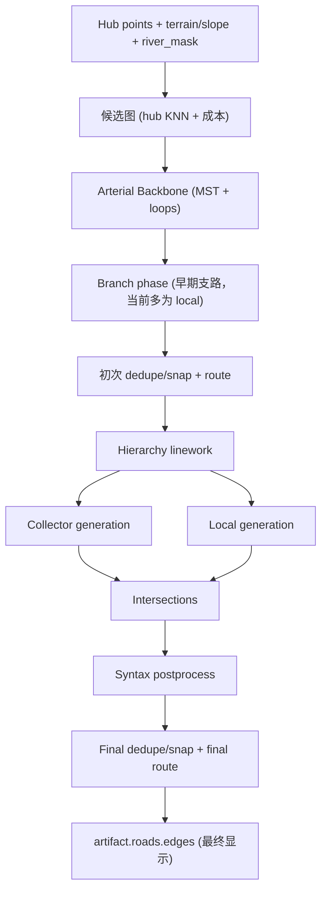

# CityGen Major Roads 生成方案说明（Arterial + Collector）

本文档解释两个问题：

1. `Arterial + Collector` 是什么（为什么 UI 的 `Major Roads` 会包含一些看起来不像“主干”的短线）
2. 当前项目里 `Major Roads` 的实际生成方案（后端算法 + 前端流式显示与最终显示的差异）

适用代码版本（当前仓库实现）：

- `engine/roads/network.py`
- `engine/roads/classic_growth.py`
- `engine/roads/classic_local_fill.py`
- `web/src/render/cityRenderer.ts`
- `web/src/render/stageRenderer.ts`

---

## 1. 什么是 `Arterial + Collector`

在本项目里，`Major Roads` 不是“只有一类主干道”，而是一个 UI 合并层：

- `arterial`：主骨架道路（城市级连接）
- `collector`：次干/汇集道路（连接主骨架与局部网络）

也就是说：

- **UI 的 `Major Roads` = `arterial + collector`**
- **UI 的 `Local Roads` = `local + service`**

这就是你会看到一些较短的线段仍被算进 `Major Roads` 的原因：它们通常是 `collector`，不是 `local`。

前端实现位置：

- `web/src/render/cityRenderer.ts`（最终渲染）
- `web/src/render/stageRenderer.ts`（生成期 streaming overlay）

---

## 2. 为什么看起来“生成过程”和“最终显示”不一致

这是当前系统的正常现象，不是单点 bug。原因是你看到的是两套数据/渲染阶段：

### 2.1 生成过程（Streaming Overlay）

生成中显示的是增量事件，例如：

- `road_trace_progress`（正在生长的 trace）
- 增量节点（橙色点）
- 增量 edge / polyline edge

这些是“过程可视化”，用于展示算法生长轨迹，不是最终成图。

### 2.2 最终显示（Artifact）

生成完成后显示的是：

- `artifact.roads.edges`

这些边已经经过后处理：

- `dedupe/snap`
- `intersection operators`
- `space syntax postprocess`
- `final route`

所以最终几何形态、长度、连接方式可能和 streaming 过程明显不同。

### 2.3 你截图里为什么会更明显

截图里出现 `No artifact loaded.`，说明当时看到的主要是 streaming overlay，而不是最终 artifact。

因此：

- 中间大量短白线（collector traces）在过程里会比较碎
- 最终 artifact 里会被切分/重路由/重建后再显示

---

## 3. Major Roads（Arterial + Collector）后端生成总流程

入口函数：

- `engine/roads/network.py::generate_roads(...)`

高层流程：

注意：

- `Major Roads` 的核心是 **Arterial + Collector**
- `Branch phase` 里会生成一些 `local`，但它不是 `collector`

---

## 4. Arterial（主骨架）怎么生成

Arterial 在 `generate_roads(...)` 前半段完成。

### 4.1 候选图（Candidate Graph）

输入是 hub（T1/T2/T3）：

- 每个 hub 连到若干近邻（`k_neighbors`）
- 候选边成本考虑：
  - 距离
  - 坡度
  - 过河代价
- 若图不连通，会补连通桥边

输出：

- 带权候选图
- `candidate_debug`（前端 `Candidate Edges` 调试层）

### 4.2 Arterial Backbone 选择

从候选图中选主骨架：

- 先做 `MST`（保证连通）
- 再按 `loop_budget` 加 loop（提高可达性与环路结构）

选中的边会标记为：

- `road_class = "arterial"`

这是 `Major Roads` 中最“主干”的部分。

---

## 5. Collector（次干/汇集道路）怎么生成

Collector 在 `_generate_hierarchy_linework(...)` 中生成，并且**先于 local**。

### 5.1 生成空间域：由 arterial 切出的宏块

Collector 不是在整张图随意铺线，而是先构造 `collector_blocks`：

- 基于当前道路网络（至少包含 arterial + branch）
- 结合河流面/边界做 block polygon 提取

所以 collector 的空间域是：

- **被 arterial 骨架切出来的宏观块**

### 5.2 Collector backend（当前默认）

当前 collector 支持：

- `classic_turtle`（默认）
- `grid_clip`（降级/回退）

默认情况会走：

- `engine/roads/classic_growth.py::generate_classic_collectors(...)`

### 5.3 `classic_turtle` 生长特点（为什么你会看到短 collector）

Collector 采用多种子 + 优先队列的 trace 生长，而不是一条“超长线一次画完”：

- 多个种子点（来自 arterial portals、block 内点、河岸点等）
- trace 遇到网络会连接/终止
- 会分支、会被地形/河流约束
- 流式阶段会实时输出 `collector-trace-*`

这会导致 streaming 过程中 collector 看起来：

- 片段化
- 分散
- 逐步长出

但这不代表最终 artifact 仍然完全是同样的短段样子。

---

## 6. UI 中 `Major Roads` 的含义（当前实现）

### 6.1 最终渲染（Artifact）

`web/src/render/cityRenderer.ts` 的定义：

- `arterial` 或 `collector` => `Major Roads`

即：

- `Major Roads` 显示最终 artifact 中的 `arterial + collector`

### 6.2 生成期 Streaming Overlay

`web/src/render/stageRenderer.ts` 的定义同样是：

- `arterial` / `collector` => `Major Roads`
- `local` / `service` => `Local Roads`

所以如果你关掉 `Local Roads`，仍然看到一些短线：

- 这些很可能是 `collector`（属于 `Major Roads`）

---

## 7. 为什么你会误以为“这像 local roads”

因为 `collector` 在生成期常常有这些视觉特征：

- 线段较短（相对 arterial）
- 数量较多
- 跟着 block 和地形/河流长
- streaming 时是过程片段，不是最终聚合形态

这在视觉上容易被误判成 local。

本质上是：

- **road hierarchy 语义（collector）**
- 与 **过程可视化几何（trace 片段）**

叠加造成的认知偏差。

---

## 8. Local roads 与 Major roads 的关系（当前最新改动）

最近的本地道路修复（`classic_local_fill`）已经改为：

- local root seeds 优先从 `arterial + collector`（即当前 `Major Roads`）上预计算 portal seeds
- 种子点间隔在 `400m ~ 500m` 随机波动
- 一开始就固定这些种子，再进行 local 生长

这意味着：

- local 在生成语义上已经是“从 major network 长出来”
- UI streaming 看到的 local trace 起点会更贴近 major roads

备注：

- 对于没有 major 接触的残余区域（例如补网残余 block），仍可能使用 fallback seed（避免完全无 local）

---

## 9. 如果产品上希望更清晰（建议）

如果你希望 UI 语义更符合直觉，可以考虑下面任一方案：

### 方案 A：改名（最小改动）

把 `Major Roads` 改成：

- `Arterial + Collector`

优点：

- 不改数据结构和渲染逻辑
- 立即消除“这也算 major？”的歧义

### 方案 B：拆层（最清晰）

把线层拆成：

- `Arterials`
- `Collectors`
- `Local Roads`

优点：

- 生成过程与最终显示更容易对齐理解
- 调试 collector/local 生长逻辑更直接

代价：

- 需要扩前端 layer 配置、legend、stage 映射、streaming layer gating

### 方案 C：保留现有 UI，但加注释说明

在 `Major Roads` legend/tooltip 中注明：

- `Arterial + Collector`

优点：

- 改动小
- 用户理解成本明显下降

---

## 10. 一句话总结

你看到的“看起来像 local 的 major roads”大多是 **collector**；当前 UI 的 `Major Roads` 本来就定义为 **`arterial + collector`**。生成过程与最终显示不一致，是因为前者是 **streaming 过程轨迹**，后者是 **artifact 后处理完成的最终路网**。

