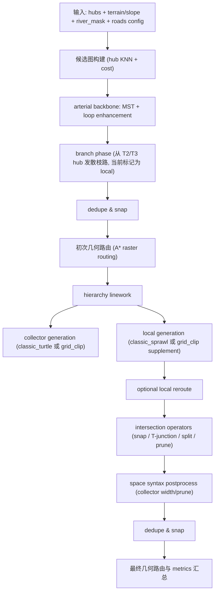

# CityGen 当前道路生成算法技术文档（Arterial / Collector / Local）

本文档描述当前代码库中“道路生成”阶段的实际实现（不是理想设计），覆盖：

- `arterial`（主骨架）
- `collector`（次干/汇集道路）
- `local`（本地道路）
- 交叉口拓扑修复、空间句法后处理、几何重路由
- 指标与流式进度输出

文档基于当前实现代码梳理：

- `/Users/shiqi/Coding/github/GIStudio/CityGen/engine/generator.py`
- `/Users/shiqi/Coding/github/GIStudio/CityGen/engine/roads/network.py`
- `/Users/shiqi/Coding/github/GIStudio/CityGen/engine/roads/classic_growth.py`
- `/Users/shiqi/Coding/github/GIStudio/CityGen/engine/roads/classic_local_fill.py`
- `/Users/shiqi/Coding/github/GIStudio/CityGen/engine/roads/local_reroute.py`
- `/Users/shiqi/Coding/github/GIStudio/CityGen/engine/roads/intersections.py`
- `/Users/shiqi/Coding/github/GIStudio/CityGen/engine/roads/syntax.py`
- `/Users/shiqi/Coding/github/GIStudio/CityGen/engine/roads/terrain_probe.py`

## 1. 总体入口与调用链

道路生成入口位于：

- `/Users/shiqi/Coding/github/GIStudio/CityGen/engine/generator.py` 中调用 `generate_roads(...)`
- `/Users/shiqi/Coding/github/GIStudio/CityGen/engine/roads/network.py` 中实现 `generate_roads(...)`

高层流程如下：

## 2. 数据结构与道路等级定义

当前道路构建使用运行时结构（`engine/roads/network.py`）：

- `BuiltRoadNode`
  - `id`
  - `pos: Vec2`
  - `kind`（如 `hub` / `branch` / `local` / `collector` / `junction`）
- `BuiltRoadEdge`
  - `u`, `v`
  - `road_class`（`arterial` / `collector` / `local`）
  - `weight`, `length_m`, `river_crossings`
  - `width_m`, `render_order`
  - `path_points`（几何折线）
  - `flags`（如 `culdesac`, `local_grid_supplement`, `local_rerouted`）

注意：

- Branch 阶段（`_generate_branches`）会提前生成一些 `road_class="local"` 边。
- Collector / Local 的主体分层线网在后续 `_generate_hierarchy_linework(...)` 才完成。

## 3. 代价模型与基础几何路由（所有等级共享）

### 3.1 线段代价 `_segment_cost(...)`

用于候选边评估和折线总代价计算，输入为起终点直线段：

- 基础成本：`length`
- 坡度惩罚：`length * (1 + slope_penalty * slope_norm)`
- 过河惩罚：`river_crossings * river_cross_penalty`

其中：

- `slope_norm` 来自沿线采样平均坡度 / 全局最大坡度
- `river_crossings` 通过沿线采样 `river_mask` 的进出变化近似统计

### 3.2 栅格 A* 几何路由 `_route_points_with_cost_mask(...)`

用于将一条线（尤其 collector/local reroute 或初始骨架边）变成受地形/河流影响的折线：

- 在降采样栅格上进行 8 邻域 A*
- 成本项包含：
  - 坡度成本（平方项）
  - 河流穿越罚分
  - 可选 corridor mask（限制局部重路由只在走廊内）
- 不同等级道路使用不同惩罚权重
  - `arterial` 坡度/过河惩罚更高
  - `collector` 次之
  - `local` 对河流仍较敏感
- 路由结果经过去重与 RDP 简化

## 4. Arterial（主骨架）算法

Arterial 的生成主要在 `generate_roads(...)` 前半段完成。

### 4.1 候选图构建 `_build_candidate_graph(...)`

输入是 hub 点（T1/T2/T3）：

- 对每个 hub 选择 `k_neighbors`
- 计算 hub 间候选边成本（使用 `_segment_cost`）
- 构建带权无向图（`networkx.Graph`）
- 若图不连通，迭代添加跨连通分量的最小代价桥边，直到连通

结果：

- 候选图（用于 backbone 选择）
- `candidate_debug`（前端可视化候选边调试层）

### 4.2 Backbone 选择 `_generate_backbone_edges(...)`

Arterial backbone 采用：

- 最小生成树（MST）保证基础连通
- Loop enhancement（受 `loop_budget` 限制）
  - 在非树边中计算 detour reduction gain
  - 选择 gain 高且大于阈值（`> 0.10`）的边加入

这一步输出的边全部标记为：

- `road_class="arterial"`
- `width_m=18`

### 4.3 Branch 相位 `_generate_branches(...)`

这一步是“hub 发散枝路”，当前实现并不生成 collector，而是生成一些早期 `local`：

- 从 T2/T3 hub 出发（T1 跳过）
- 方向初始值近似以城市中心为参考
- 每一步在多个候选方向中选择代价最小者（带坡度/过河/碰撞约束）
- 避免与已有节点/边非法相交
- 生成 `branch` 节点与 `local` 边

特点：

- 这是一种早期“结构补全/放射化”步骤
- 在 collector/local 分层之前先添加一些局部支路骨架

### 4.4 初次拓扑清理与几何路由

在 arterial + branch 之后会做：

- `_dedupe_and_snap(...)`
  - 节点按网格桶吸附
  - 边按 `(u,v,road_class)` 去重
  - flag 合并（如 `culdesac`）
- `_route_all_edges(...)`
  - 对没有 `path_points` 的边做栅格 A* 路由
  - 对已有 `path_points` 的边重算 `weight/length/crossings`

## 5. Collector（次干道路）算法

Collector 在线网分层函数 `_generate_hierarchy_linework(...)` 中生成，并且先于 local 生成。

### 5.1 Collector 的 block 输入

Collector 并不是直接在全图铺线，而是先构造由当前网络划分的宏观块：

- 调用 `_build_block_polygons_from_network(...)`
- 该函数内部使用 `/engine/blocks/extraction.py::extract_macro_blocks(...)`
- 输入是当前已有道路网络（此时至少有 arterial + branch）与 river areas

因此 collector 的空间域是“arterial 骨架切出的宏块”。

### 5.2 Backend 选择与兼容逻辑

Collector 支持两类 backend（当前有效）：

- `classic_turtle`（默认）
- `grid_clip`（规则填充回退）

兼容逻辑：

- `tensor_streamline` 目前被映射为 `classic_turtle`（兼容旧配置名）
- 未识别 backend 会降级为 `grid_clip`

### 5.3 `classic_turtle`（主路径）: `classic_growth.py`

核心函数：

- `generate_classic_collectors(...)`
- `ClassicRoadGenerator.grow()`

#### 5.3.1 Seed（种子）策略 `seed_classic_portals(...)`

Collector 种子来源是混合策略，不是单一 arterial 中点：

- 沿 arterial 边按 `classic_seed_spacing_m` 撒 portal seeds
- 靠近河岸的 arterial seed 会生成额外 `riverfront_arterial` seeds
- 大 block 的 centroid / representative point seeds
- 临河 block 的 `riverfront_block` seeds（带回连 arterial 偏好）

Seed 元信息包含：

- `seed_kind`
- `must_attach_arterial`
- `riverfront_bias_steps`

#### 5.3.2 生长状态与队列

Collector 使用优先队列（heap）管理 turtle 状态 `_QueueState`：

- `pos`
- `direction`
- `depth`
- `must_attach_arterial`
- `arterial_attach_budget_steps`
- `riverfront_bias_steps_remaining`

这使得它是“多种子、多分支、优先队列驱动”的生长，而非单条 DFS 追踪。

#### 5.3.3 单条 trace 生长 `_trace(...)`

每步主要过程：

- 根据坡度使用 `TerrainProbe`
  - 平缓时偏向直接延伸
  - 陡坡时更可能蛇形/顺等高线
- 地形与水文偏置
  - 河岸切向偏置（parallel bias）
  - 河岸 setback 保护
- 结构偏置
  - 临近 arterial 时倾向与 arterial 切线对齐或垂向出发
  - 轻度 hub 吸引
- 转角限制 `_clamp_turn(...)`
- 边界/河流/自相交检查
- 距离 arterial 上限约束（避免 collector 无限漂离）
- 网络连接策略
  - 优先 T 型附着到 arterial（`near_arterial_t`）
  - 必要时回退附着到任意已有网络（`near_network_fallback`）
- 与运行中 collector 过近去重（避免重复平行线）

终止条件（典型）：

- `boundary`
- `river_blocked`
- `arterial_too_far`
- `self_intersection`
- `near_arterial_t`
- `near_network_fallback`
- `stochastic_stop`
- `max_len`

#### 5.3.4 分支机制 `_maybe_enqueue_branches(...)`

Collector 生长中会按深度衰减概率生成侧向分支：

- 概率由 `classic_branch_prob` 和 `classic_depth_decay_power` 控制
- 高坡度降低分支概率
- 分支角度约在 65°–105°（左右两侧）

#### 5.3.5 输出与指标

`generate_classic_collectors(...)` 输出：

- `traces`（折线）
- `cul_flags`
- `notes`
- `numeric metrics`

典型指标包括：

- `collector_classic_trace_count`
- `collector_classic_riverfront_seed_count`
- `collector_classic_riverfront_trace_count`
- `collector_classic_arterial_t_attach_count`
- `collector_classic_network_attach_fallback_count`

### 5.4 `grid_clip`（回退路径）

当 classic collector 不可用/失败/无结果时，使用几何规则化填充：

- 遍历 collector 宏块
- 过滤太小 block / part
- 以 polygon 主轴方向为基准（`minimum_rotated_rectangle`）
- 根据 `road_style` 进行角度抖动（`grid` / `organic` / `mixed_organic`）
- 在 polygon 内生成平行线并裁剪（`_parallel_lines_in_polygon`）
- 转为 collector edges

这是稳定回退方案，但更规则化，真实性通常低于 `classic_turtle`。

## 6. Local（本地道路）算法

Local 在 `_generate_hierarchy_linework(...)` 中生成，位于 collector 之后。

### 6.1 Local 的 block 输入

Local 会在 collector 生成完成后，重新计算一次 block：

- 再次调用 `_build_block_polygons_from_network(...)`
- 因此 local 是在“arterial + branch + collector”共同切分的 block 内生长

这也是 local 能进一步细分街区的关键。

### 6.2 Backend 选择

当前 local backend：

- `classic_sprawl`（默认）
- `grid_clip`（回退）

如果 `classic_sprawl` 不可用或失败，会降级为 `grid_clip`。

### 6.3 `classic_sprawl`（主路径）: `classic_local_fill.py`

核心函数：

- `generate_classic_local_fill(...)`

#### 6.3.1 核心理念

Local 不是全图生成，而是 **block 内部填充**：

- 每个 block 独立约束
- 强制道路保持在 block 内（不允许轻易越界）
- 借助 collector/arterial 的切向信息塑形

#### 6.3.2 Seed 策略（当前实现：major portal 优先 + centroid fallback）

当前实现的 local seed **不是边界播种优先**。默认优先从冻结后的 major network（`arterial + collector`）上生成 portal seeds：

- 沿 major polyline 按区间采样（目标间距由 `local_major_seed_spacing_*` 控制）
- 在 road 切线两侧取法线方向，向 block 内部 inset 形成 portal seed
- 用 block 内部可用前向净空（clearance）筛选 portal，避免把 seed 放在无空间方向
- 每个 portal seed 生成一个 `_State(depth=0, branch_role=mainline)`

Fallback（没有 major 接触的 residual/coverage 补线 polygon）：

- 使用 block centroid / representative point / MRR 边上点
- 仍以“向 block 内部生长”为原则，不回退到边界法播种

这保证 local 在主路径中视觉上和拓扑上都是“从 major network 向街区内部扩展”。

#### 6.3.3 Trace 长度目标（语义层，非最终 edge；当前默认已升级）

当前 local 长度控制作用在 `classic_local_fill` 的 **trace continuity**（不是最终 topology split 后的 edge）：

- 长主线（mainline）目标区间：约 `1200m–4800m`
- 软上限：约 `5600m`
- 硬上限：默认 `6000m`（复用 `local_classic_max_trace_len_m` 语义）
- `sub_local_connector`（连接导向分支）使用更短长度 cap（默认约 `<=1800m`）
- `fill_branch`（格点填充分支）保持更短/中等长度策略
- 小 block 仍可按长轴阈值走例外路径（不强推长 trace）

实现方式（当前）：

- 为每个 block 计算动态 `trace_len_cap` 与 `endpoint_span_cap`
- 针对大 block 开启 trace target，同时 mainline 受 6km hard cap 保护
- 输出 trace 级长度统计与长主线统计指标（见 9 节）

注意：

- `500m–1000m` 指标仍保留，但更偏“历史兼容/过渡指标”
- 最终 edge 会因为交叉口拆分、拓扑修复、语法裁剪变短（trace 连续性 != 最终单条 edge 长度）

#### 6.3.4 单条 local trace 生长（block 内）

每步主要过程：

- `TerrainProbe` 处理坡度/河流偏置
- 近 collector 切线引导
  - 有概率平行 collector
  - 有概率近似垂直 collector（形成横向街）
- 转角限制 `_clamp_turn`
- block 边界约束（离开 block 即终止：`block_exit`）
- 河流水域与 riverfront 偏置处理
- 距离高阶道路上限（`arterial + collector`）约束：`road_too_far`
- 自相交检查
- 近网络吸附终止（`near_network`）

#### 6.3.5 Branching（局部支路）

当前 local branching 是两层机制并行：

1. **主线 sub Local 连接分支（根干线优先）**
   - 对 root/shallow `mainline` 增加里程调度器
   - 每 `200–400m`（默认）触发一次左右分支尝试
   - 分支 role = `sub_local_connector`
   - 目的不是单纯加密，而是优先连接其他 local traces（local-local connectivity）

2. **格点式 fill branching（保留）**
   - 基于累计距离跨过 `local_spacing_m` 网格区间时评估分支
   - 作为 `fill_branch` 的形态填充机制，不替代 sub Local 连接分支

- 分支角度仍以正交为主（约 88°–92°）
- 格点分支概率受：
  - 坡度
  - 深度衰减
  - 距离高阶道路远近
影响

这比纯随机分支更容易形成规整可读的 local 交叉格局，同时通过 sub Local 机制提升 local-local 连通。

#### 6.3.6 停止条件（local）

常见 stop reasons：

- `boundary`
- `block_exit`
- `river_blocked`
- `road_too_far`
- `self_intersection`
- `near_network`
- `span_cap`
- `noodle_curve`
- `stochastic_stop`
- `max_len`

其中：

- `span_cap` 用于约束端点跨度（防止过度拉长）
- `noodle_curve` 用于防止低跨度高长度的“面条曲线”
- `reached_trace_cap` 会单独记录 trace 是否触达 hard cap（默认 6km）
- 若触达 hard cap 且仍未与其他 Local Roads 建立连接，会标记为 `overlimit_unconnected` 候选，供 `network.py` 后处理端点连桥使用

#### 6.3.7 接受准则与 trace 元信息

被接受的 local trace 会记录 `LocalTraceMeta`：

- `block_idx`
- `is_spine_candidate`
- `connected_to_collector`
- `culdesac`
- `branch_role`（`mainline` / `sub_local_connector` / `fill_branch`）
- `trace_len_m`
- `local_touch_count`
- `reached_trace_cap`
- `terminal_stop_reason`
- `is_overlimit_unconnected_candidate`

这些元信息随后用于 local geometry reroute 候选选择，以及 `network.py` 的 local endpoint bridge 后处理筛选。

### 6.4 Local `grid_clip` 回退与补线（supplement）

当 `classic_sprawl` 失败，或 classic 生成量不足时，系统会使用 `grid_clip` 生成/补充 local lines。

#### 6.4.1 触发场景

- `local_backend != classic_sprawl`
- 或 `classic_sprawl` 成功但 local 数量低于目标（`local_need_grid_supplement=True`）

#### 6.4.2 当前补线策略（已预算化）

补线不再无限刷满所有 residual blocks，而是预算驱动：

- 根据 deficit 生成 `local_grid_supplement_budget`
- 在 supplement 模式下每个 block/part 最多补少量线（典型 1–2 条）
- 达到预算即停止

生成方式仍是：

- polygon 内平行线裁剪 `_parallel_lines_in_polygon`
- 优先参考附近高阶道路切向角度

这一步的目标是补层级密度和连通性，不是把所有 residual block 填成满网格。

### 6.5 Local geometry reroute（可选几何重路由）

local topology（节点连接关系）来自 classic/grid clip trace，但几何形状可二次重路由。

相关模块：

- `/engine/roads/local_reroute.py`

流程：

1. 从 `pending_local_entries` 中选择候选
   - `selective` / `connectors_only` 等覆盖策略
   - 优先连接 collector 的 trace、spine candidate、较长 trace
2. 构建 reroute corridor
   - 原 trace buffer
   - 与 block 内域相交
   - 扣除 river setback
3. 对采样 waypoints 分段 A* 路由
4. 后处理
   - simplify
   - Chaikin 平滑
5. 结果质量门禁（在 `network.py` 中）
   - 拒绝极端长度增益
   - 拒绝“noodle”型高曲折度 reroute

输出 flag 示例：

- `local_candidate_reroute`
- `local_rerouted`
- `local_reroute_rejected_*`

补充（当前实现新增）：

- 在 local reroute 完成后、append local edges 前，`network.py` 会对 `pending_local_entries` 做一轮 **endpoint bridge** 后处理：
  - 只针对触达 trace hard cap 且未连接到其他 local 的候选
  - 从全局 local endpoints 池中配对（不按 major-defined block 硬限制）
  - 使用 local A* 路由生成 `local_endpoint_bridge`
  - 成功后作为普通 local pending entry 进入统一 append / intersections 流程
- `local_rerouted`
- `local_reroute_rejected`
- `local_reroute_rejected_noodle`

### 6.6 Local 最终 append 与长折线切段保护

在 `_append_polyline_edge(...)` 中，local 会额外经过一个“最终切段器”：

- 若折线总长过长且高曲折度，按长度切分成多个 chunk
- `culdesac` 标记只保留在末段

这是一层极端保护，用于防止局部几何异常扩大。

## 7. 交叉口与拓扑后处理（所有等级生效）

`generate_roads(...)` 在 hierarchy linework 之后调用：

- `apply_intersection_operators(...)`（`engine/roads/intersections.py`）

处理顺序固定如下。

### 7.1 Snap endpoints to nodes

- 将 collector/local 端点吸附到附近现有节点
- 候选优先级倾向 `arterial/hub`，再 collector/local

### 7.2 T-junction 创建（端点吸附到线段并切分）

- 将 collector/local 端点吸附到其他道路线段投影点
- 对端点附近角度做轻度优化（更像正交 T 接）
- 记录被命中的 target edge，后续在投影点处切分

### 7.3 Crossing split（显式交叉切分）

- 检测非法 crossing（非共享端点相交）
- 在交点处切分对应 edge

### 7.4 短悬挂边修剪（prune dangles）

- 对 collector/local 的短 dangling edge 做修剪
- 对 local 更宽松（避免把真实短 cul-de-sac 全删掉）
- `culdesac` flag 边会被保留

## 8. 空间句法后处理（Space Syntax）

模块：

- `/engine/roads/syntax.py`

目标对象：

- 只对 `arterial + collector` 计算 syntax 分数
- local 不参与 syntax 打分与裁剪

### 8.1 分数计算 `compute_space_syntax_edge_scores(...)`

当前实现使用：

- `networkx.edge_betweenness_centrality`
- 按 edge `length_m` 作为权重
- 分数归一化到 `[0,1]`

### 8.2 应用规则 `apply_syntax_postprocess(...)`

两类操作：

- 高 choice collector 加宽
  - 高于 85% 分位数的 collector 会提升 `width_m`
- 低 choice collector 裁剪（可选）
  - 按 `syntax_prune_quantile` 选低分 collector 候选
  - 仅尝试裁掉低度节点连接的 collector
  - 保持网络大连通分量比例不显著下降
  - 至少保留初始 collector 的 15%

## 9. 指标、日志与流式事件（用于 UI / Debug）

### 9.1 进度阶段（progress_cb）

`generate_roads(...)` 会发出阶段进度，典型包括：

- `roads.candidate_graph`
- `roads.backbone`
- `roads.branches`
- `roads.snap`
- `roads.route_initial`
- `roads.hierarchy`
- `roads.intersections`
- `roads.syntax`
- `roads.route_final`
- `roads.done`

### 9.2 流式事件（stream_cb）

典型事件：

- `road_node_added`
- `road_edge_added`
- `road_trace_progress`

其中 `road_trace_progress` 同时用于 collector/local 的 trace 生长过程可视化。

### 9.3 关键 metrics（当前版本）

道路总指标：

- `connected`
- `connectivity_ratio`
- `dead_end_count`
- `illegal_intersection_count`
- `bridge_count`

Collector 指标：

- `collector_added_count`
- `collector_classic_trace_count`
- `collector_classic_riverfront_*`
- `collector_classic_arterial_t_attach_count`

Local 指标：

- `local_added_count`
- `local_classic_trace_count`
- `local_culdesac_edge_count_pre_topology`
- `local_culdesac_edge_count_final`
- `local_reroute_*`
- `local_grid_supplement_budget`
- `local_grid_supplement_added_count`

Local trace 统计（语义 trace 层）：

- `local_classic_trace_len_p50_m / p90 / p99`
- `local_classic_trace_short_rate`
- `local_classic_trace_target_band_rate`（500–1000m）
- `local_classic_trace_long_rate`
- `local_classic_trace_nonexception_target_band_rate`

## 10. 配置入口（RoadsConfig）与算法映射

配置模型位于：

- `/Users/shiqi/Coding/github/GIStudio/CityGen/engine/models.py::RoadsConfig`

重要映射关系：

- `loop_budget` -> arterial backbone loop enhancement
- `collector_spacing_m / collector_jitter` -> collector grid_clip 密度与抖动
- `collector_generator` -> `classic_turtle` / `grid_clip`
- `local_spacing_m / local_jitter` -> local grid_clip 与 classic sprawl branching节奏
- `local_generator` -> `classic_sprawl` / `grid_clip`
- `local_geometry_mode` 与 `local_reroute_*` -> local 几何重路由
- `intersection_*` -> 拓扑后处理
- `syntax_*` -> collector 句法宽化/裁剪

兼容项：

- `tensor_*` 参数目前主要用于兼容旧 `collector_generator=tensor_streamline`
- 当前实现会将 `tensor_streamline` 映射为 `classic_turtle`

## 11. 当前实现的关键工程特性（实际行为总结）

### 11.1 先后顺序是“先路网，再 blocks/parcels”

当前后端不是先生成 blocks：

- 先生成 arterial/collector/local 道路
- 再由道路网络提取 blocks
- 再基于 blocks 生成 parcels

因此 blocks/parcels 的形态问题通常先追溯到道路生成与道路拓扑质量。

### 11.2 Collector / Local 都依赖 block 提取

- Collector 在 arterial 骨架切分的 block 中生成
- Local 在加入 collector 后重新切分的 block 中生成

这意味着 block 提取质量会反过来影响后续道路填充质量（尤其 local）。

### 11.3 Local 的“长度目标”是语义 trace，不是最终 edge

当前实现已经把 local 长度目标定义在 `classic_local_fill` trace 层：

- 更符合生成算法语义
- 不与后续交叉口切分/语法裁剪冲突

但最终可视化看到的 `local edge` 仍可能显著短于 trace（例如 `_append_polyline_edge(...)` 会对长且曲折的 local polyline 做切段保护）。

## 12. 调试与排障建议（按当前架构）

如果问题是某一级道路“形状异常”，建议按以下顺序看：

1. 看 `road_result.metrics` 和 `metrics.notes`
2. 区分是 trace 层问题还是 topology/postprocess 问题
3. 检查 stop reasons / reroute rejected / supplement budget
4. 检查 intersections 和 syntax 是否过度切分或裁剪
5. 再检查 blocks/parcels（它们通常是道路问题的后果）

推荐重点指标：

- `collector_classic_trace_count`
- `local_classic_trace_len_p50_m/p90/p99`
- `local_grid_supplement_budget / added`
- `local_reroute_applied_count / rejected_noodle_count`
- `intersection_*`
- `syntax_pruned_count`

## 13. 非目标与未覆盖（当前实现边界）

本文档描述的是“当前代码行为”，不代表：

- 城市规划意义上的最优道路生成
- 平面图严格约束下的全局拓扑最优
- 参数调整后一定达到目标形态（例如 local trace 的 500–1000m 指标现在主要是历史兼容指标，当前默认设计更偏长主线 + 6km trace continuity）

如果需要进一步演进，建议将下一版文档拆成两份：

- `当前实现说明`（本文件）
- `目标算法设计文档`（面向重构）
